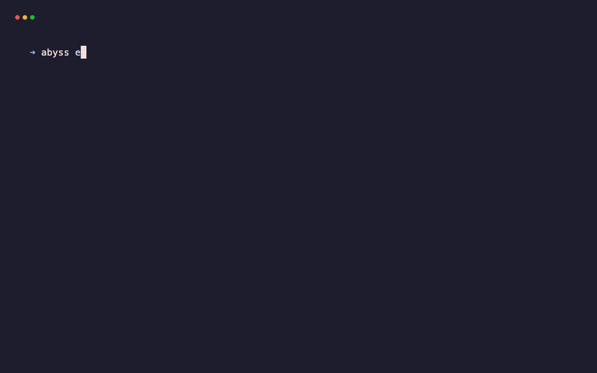

<div align="center">

# 🕳️ Abyss

**Deep Intelligence & Passive Reconnaissance Platform**

[](https://www.rust-lang.org/)
[](LICENSE)
[](https://github.com/takumaniwa/abyss/actions)



<br>

**Abyss** is a high-performance intelligence platform designed for **identifying the operators** behind target infrastructure. It excels at unmasking pirate sites, scam operations, and shadow IT by correlating hidden identifiers and querying global intelligence networks.

[Features](#-features) • [Installation](#-installation) • [Usage](#-usage) • [Attribution Strategy](#-attribution-strategy)

</div>

---

## Key Features

### Operator Attribution

Abyss extracts unique fingerprints to link anonymous sites to their owners:

- **Favicon Pivoting**: Calculates MurmurHash3 of favicons to find the real origin IP (Shodan/Censys compatible).
- **ID Tracking**: Scrapes Google Analytics (`UA-`, `G-`), AdSense (`pub-`), Facebook Pixel IDs, and Amazon Associates tags.
- **Site Verification**: Extracts Google, Facebook, Apple, and Yandex verification codes.
- **Crypto Forensics**: Identifies BTC/ETH wallet addresses used for donations or payments.
- **Contact Extraction**: Automatically finds emails, phone numbers, and social media profiles.

### Secret Mining & JS Analysis

Deep analysis of frontend assets to find leaked credentials and endpoints:

- **Credential Detection**: Scans for AWS Keys, Google API Keys, Slack Tokens, Stripe Secrets, and Private Keys.
- **Endpoint Discovery**: Extracts internal and hidden API endpoints from Javascript bundles.
- **Metadata Analysis**: Inspects `robots.txt`, `sitemaps.xml`, `security.txt`, and meta generator tags.

### Global Intelligence Integration (Total Recall)

Queries multiple external sources in parallel for a comprehensive view:

- **Passive DNS & SSL**: Leverages crt.sh and AlienVault OTX for historical subdomains and SSL identities.
- **Web Archives**: Pulls historical data and discovery timestamps from the Wayback Machine.
- **GitHub Leaks**: Searches for sensitive data leaked in public repositories.
- **Infrastructure Intel**: Queries Shodan InternetDB for open ports and known vulnerabilities.
- **GeoIP & ASN**: Provides precise location and network ownership data (IP, ISP, Org, ASN).

### Intelligence Reporting

- **JSON Output**: Clean, structured data for pipeline integration.
- **Visual Dashboard**: Generates a self-contained, dark-mode HTML report for stakeholders.

---

## Installation

```bash
git clone https://github.com/takumaniwa/abyss.git
cd abyss
make build
# Binary is located at ./target/release/abyss
```

## Usage

### Standard Scan

Run a full intelligence scan against a target.

```bash
abyss -t example.com
```

### Generate Report

Create a visual intelligence dashboard.

```bash
abyss -t example.com --html report.html
```

### Pipeline Integration (JSON)

Extract specific IDs for correlation.

```bash
# Get all AdSense IDs associated with a domain
abyss -t example.com --quiet | jq '.attribution.adsense_ids[]'

# Extract discovered API endpoints from JS files
abyss -t example.com --quiet | jq '.http.js_analysis[].endpoints[]'
```

## Attribution Strategy

To identify a pirate site operator hiding behind Cloudflare:

1. **Run Abyss**: `abyss -t pirate-site.com`
2. **Get Favicon Hash**: Note the `favicon_hash` from the output.
3. **Search Shodan**: Use `http.favicon.hash:<hash>` to find the Origin IP.
4. **Track Ads**: Search PublicWWW or similar engines for the `pub-xxxxxxxx` AdSense ID or Facebook Pixel ID to find other sites owned by the same entity.
5. **GitHub Recon**: Review `github_leaks` for any repository mentions or developer credentials.

## License

MIT License.
